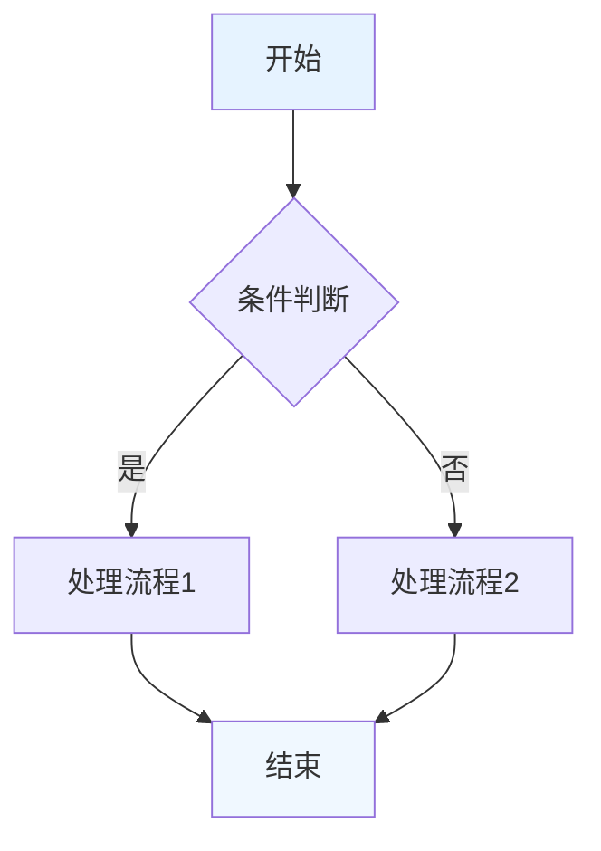
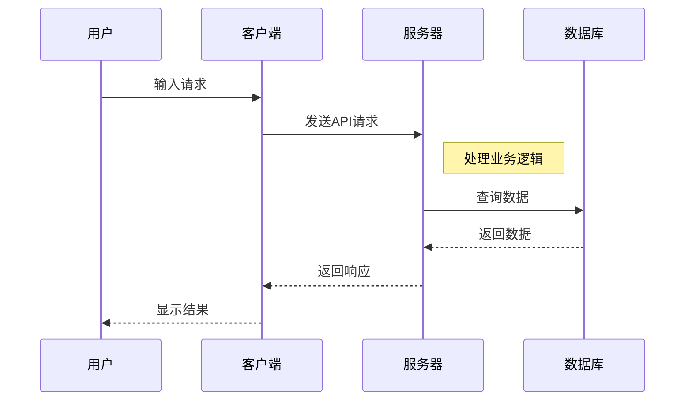
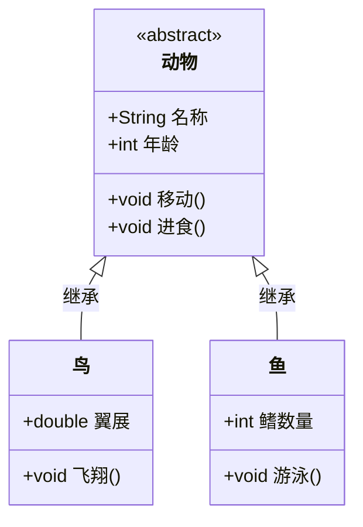
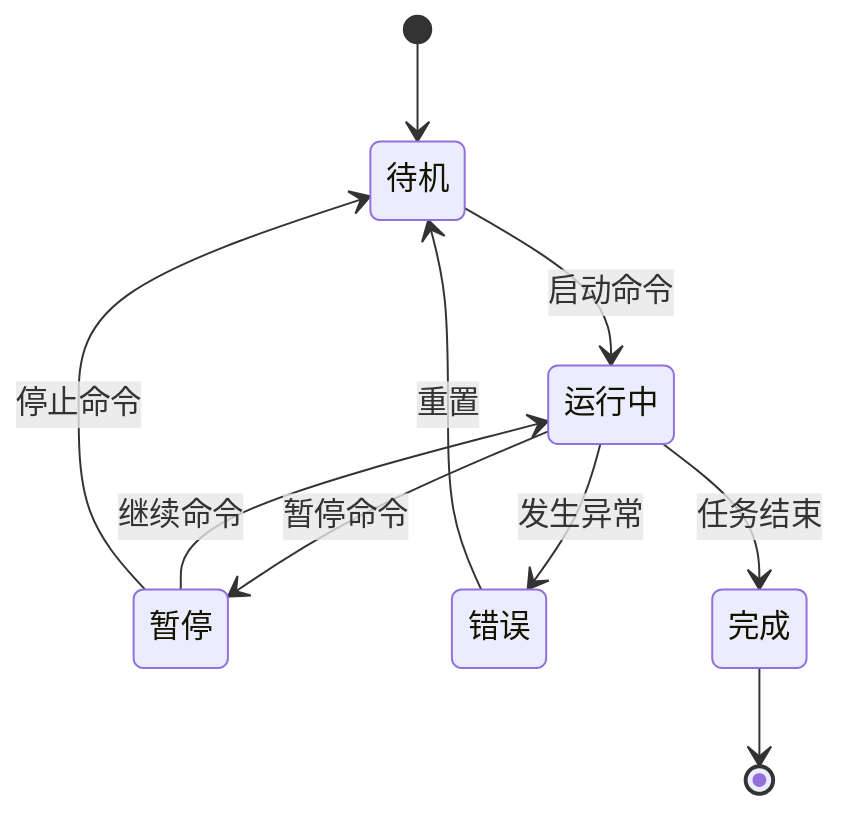
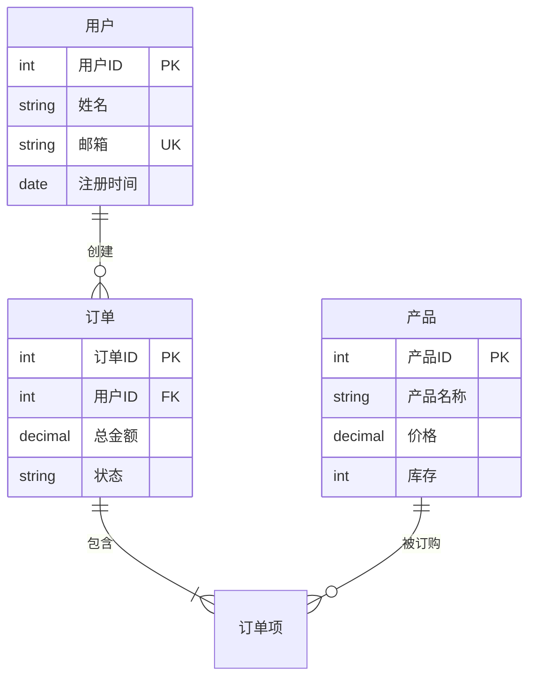
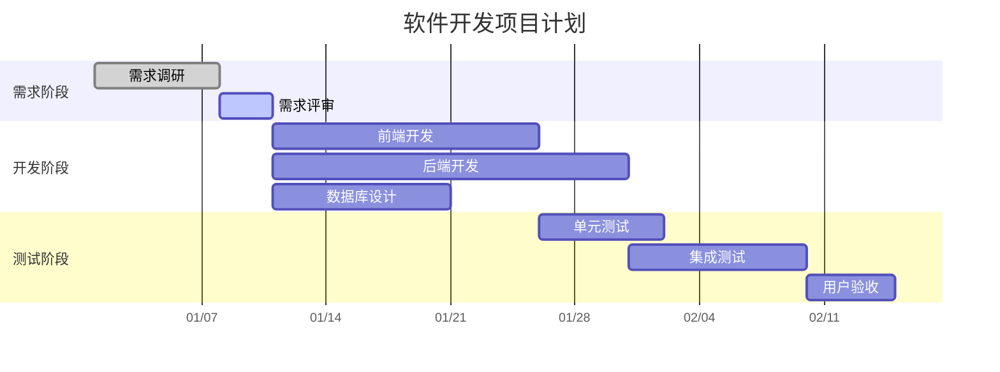
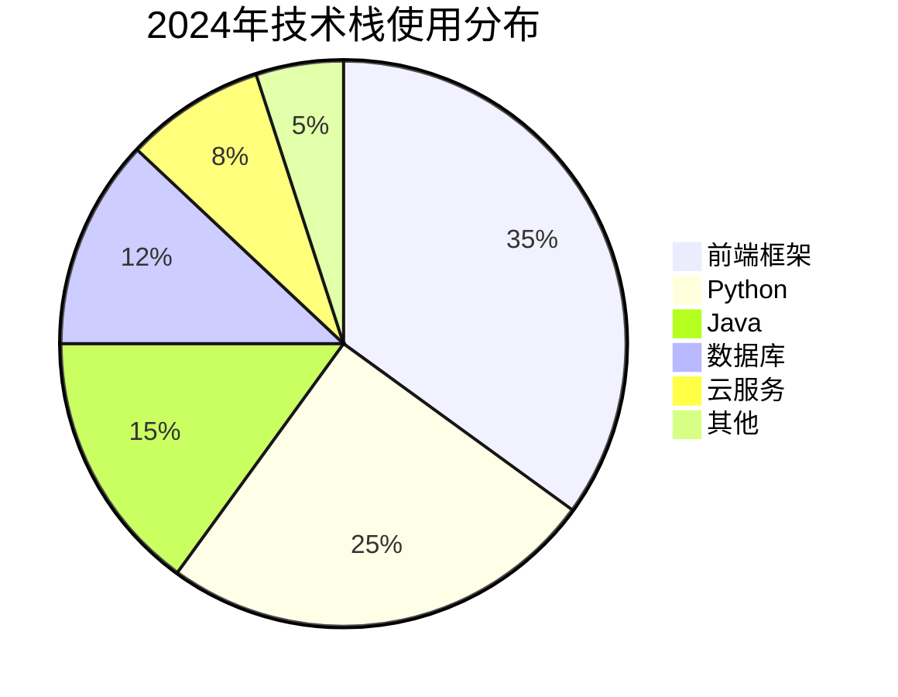
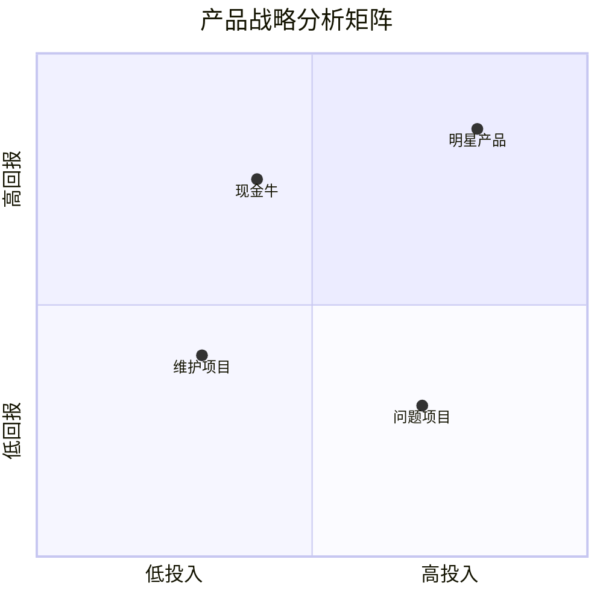
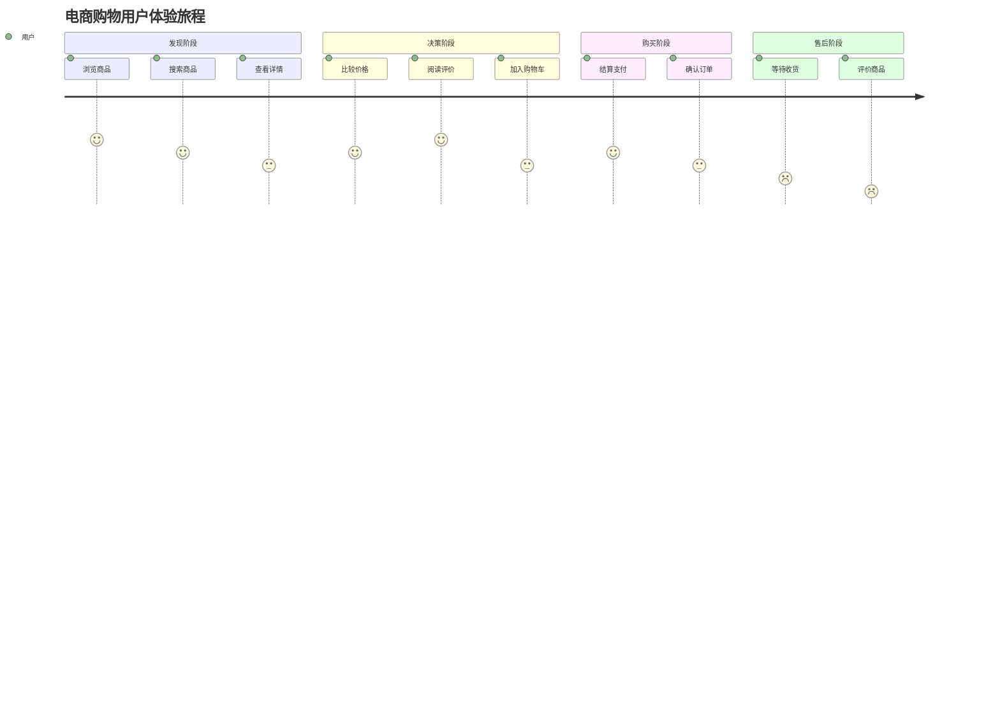
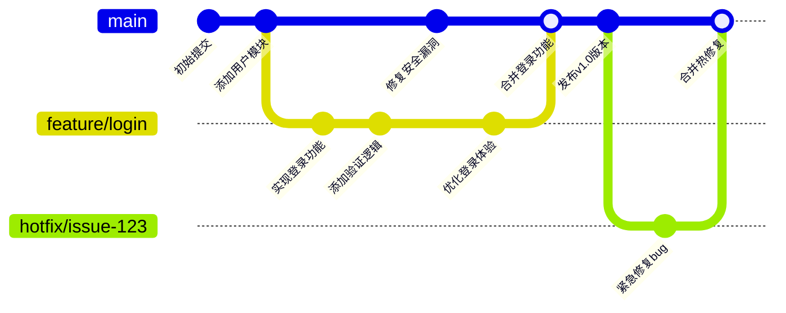

# Mermaid 图表大全（含详细介绍和对比表格）

## 图表类型对比说明表

| 图表类型 | 主要用途 | 核心特点 | 适用场景 | 学习难度 |
|---------|----------|----------|----------|----------|
| **流程图** | 展示步骤顺序和决策流程 | 节点+箭头，线性流程 | 算法设计、业务流程 | ⭐⭐ |
| **时序图** | 展示对象间时间顺序交互 | 强调时间线和消息传递 | 系统架构、API调用 | ⭐⭐⭐ |
| **类图** | 展示系统静态结构 | 类、继承、关联关系 | 系统设计、数据库设计 | ⭐⭐⭐⭐ |
| **状态图** | 描述对象状态转换 | 状态节点+转换条件 | 工作流、状态管理 | ⭐⭐⭐ |
| **ER图** | 数据库实体关系建模 | 实体+属性+关系 | 数据库设计、数据建模 | ⭐⭐⭐ |
| **甘特图** | 项目进度和时间管理 | 时间轴+任务条 | 项目管理、进度跟踪 | ⭐⭐ |
| **饼图** | 展示组成部分比例 | 圆形分割，百分比 | 市场分析、资源分配 | ⭐ |
| **四象限图** | 战略分析和优先级排序 | 二维坐标，四个区域 | 产品分析、风险评估 | ⭐⭐ |
| **用户旅程图** | 用户体验过程分析 | 阶段+用户情感 | 用户体验设计、服务优化 | ⭐⭐ |
| **Git图** | 版本控制操作可视化 | 分支、合并、提交 | 代码管理、团队协作 | ⭐⭐⭐ |

---

## 1. 流程图 (Flowchart)
**介绍**：流程图用于表示算法或工作流程的步骤顺序，通过不同形状的节点和箭头展示过程的流向。

**核心要素**：
- 矩形：处理步骤
- 菱形：决策点
- 箭头：流程方向
- 圆角矩形：开始/结束

**应用场景**：程序算法、业务流程、决策流程、工作流程设计

---

## 2. 时序图 (Sequence Diagram)
**介绍**：时序图展示对象之间交互的时间顺序，特别强调消息传递的时间线和对象生命周期。

**核心要素**：
- Participant：参与对象
- 箭头：消息传递
- 激活条：方法执行时间
- Note：注释说明

**应用场景**：系统架构设计、API调用流程、微服务交互、故障排查

---

## 3. 类图 (Class Diagram)
**介绍**：类图是面向对象系统建模的核心工具，展示类、接口、关联、继承等静态结构关系。

**核心要素**：
- 类名、属性、方法
- 继承关系：<|--
- 关联关系：--> 
- 接口实现：<|..

**应用场景**：系统架构设计、数据库设计、代码结构分析、API设计

---

## 4. 状态图 (State Diagram)
**介绍**：状态图描述对象在其生命周期内所经历的状态序列，以及状态转换的触发条件。

**核心要素**：
- 状态节点
- 转换箭头
- 触发事件
- 初始/终止状态

**应用场景**：工作流引擎、订单状态管理、游戏角色状态、设备控制

---

## 5. 实体关系图 (ER Diagram)
**介绍**：ER图用于数据库设计，展示实体、属性和实体之间的关系。

**核心要素**：
- 实体：矩形框
- 属性：字段列表
- 关系：连线符号
- 基数：||, o{, |}

**应用场景**：数据库设计、系统分析、数据模型设计

---

## 6. 甘特图 (Gantt Chart)
**介绍**：甘特图是项目管理工具，以条形图形式展示项目任务的时间安排和进度。

**核心要素**：
- 任务条：时间跨度
- 进度状态：done, active
- 依赖关系：after
- 时间轴：dateFormat

**应用场景**：项目管理、进度跟踪、资源规划、里程碑管理

---

## 7. 饼图 (Pie Chart)
**介绍**：饼图显示整体中各组成部分的比例关系，适合展示百分比分布。

**核心要素**：
- 扇形区域：比例大小
- 标题：图表主题
- 标签：分类名称
- 数值：具体占比

**应用场景**：市场占比分析、资源分配、预算分布、调查结果展示

---

## 8. 四象限图 (Quadrant Chart)
**介绍**：四象限图用于战略分析，将项目或产品按照两个维度分类到四个象限中。

**核心要素**：
- X轴：第一个维度
- Y轴：第二个维度
- 四个象限：不同策略区域
- 数据点：项目位置

**应用场景**：产品组合分析、风险评估、优先级排序、战略规划

---

## 9. 用户旅程图 (User Journey Diagram)
**介绍**：用户旅程图从用户视角展示与产品或服务交互的完整体验过程。

**核心要素**：
- 阶段：section
- 用户行为：左侧文本
- 情感分值：数字评分
- 用户角色：右侧标签

**应用场景**：用户体验设计、服务设计、客户旅程分析、产品优化

---

## 10. Git 图形 (Git Graph)
**介绍**：Git图形可视化版本控制的分支、合并、提交历史等操作。

**核心要素**：
- 提交节点：commit
- 分支：branch
- 合并：merge
- 切换：checkout

**应用场景**：版本控制教学、代码仓库管理、团队协作流程、发布管理

---

## 选择指南

### 按需求选择图表类型：

| 分析需求 | 推荐图表 | 理由 |
|---------|----------|------|
| **流程分析** | 流程图 | 清晰展示步骤顺序 |
| **时间序列** | 时序图 | 强调时间先后顺序 |
| **结构设计** | 类图/ER图 | 展示静态关系 |
| **状态变化** | 状态图 | 描述状态转换 |
| **进度管理** | 甘特图 | 时间规划和跟踪 |
| **比例分析** | 饼图 | 直观显示占比 |
| **战略决策** | 四象限图 | 多维度评估定位 |
| **用户体验** | 用户旅程图 | 完整用户视角 |
| **版本管理** | Git图 | 可视化版本历史 |

### 学习建议：
1. **初学者**：从流程图、饼图开始
2. **中级用户**：学习时序图、状态图、甘特图
3. **高级用户**：掌握类图、ER图、复杂Git图
4. **专业领域**：根据具体工作需求重点学习相关图表

这些图表工具可以显著提升技术文档的质量和沟通效率，建议根据实际需求灵活选用。